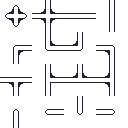
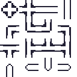
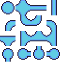

# NOT READY
&nbsp;
# AutoTile-Lib
>Sorry, I english is bad :P
&nbsp;
## Kullanımı
- ### `tilescale(<TileMap>,<Width>,<Heigth>,<Scale>,<Properties>)`
&nbsp;
tilescale foksiyonu 2 çeşit kullanımı vardır.
1. Birinci şekli Tek bir tilemap oluşturmak içindir. Böylelikle hızlıca tilemap'inizi oluşturur olursunuz.
**Burada ki kratik nokta** tilemap in büyüklüğü (width*heigth)/scale den hesaplanır. 
```lua
    local tilemap = {}
    tilemap = tilescale(tilemap,100,100,32,{sprite})
```
Çıktısı : 
```lua
    {
        {0,0,0},
        {0,0,0},
        {0,0,0}
    }
```
&nbsp;
2. Bu kullanımda tilemap i kendi içinde oluşturur bu sayede bir den fazla tilemap oluşturur ken rahat edersiniz. Ayrica isterseniz oluşturulan tilemap i çekebilirsiniz.
```lua
    tilescale(false,100,100,32,{sprite})
    --or
    local tilemap = {}
    tilemap = tilescale(false,100,100,32,{sprite})
```
&nbsp;
> Properties tablosu içeriği : 
```lua
{
    Location_X = <integer>, -- Tilelın X konumu üzerinde ki başlangıç yerini belirler.
    Location_Y = <integer>, -- Tilelım Y konumu üzerinde ki başlangıç yerini belirler.
    Sprite = , -- Tile ı doldururken kullanacağınız görüntüyü belirler. (Bu versionda sadece 1 resim şeklinde doldurula biliyor)
    Spritechange = <bool> -- resmi değiştire bilirliğini açıyor (AMA sprite tablo şeklinde olmalıdır. örnek: {sprite1,sprite2,sprite3,...})
}
```
&nbsp;
> Spritelar altaki resim referansları gibi olmalıdır.
  
&nbsp;

- ### Kalanlar `tiledraw() tilemouse() tilekeyboard`
&nbsp;
Bu kalan 3'ünü Yerlerine yerleştirin yeter.
```lua
love.draw = function()
    tiledraw()
end

love.mousepressed = function(x,y,btn)
    tilemouse(x,y,btn)
end

love.keyboard = function(key)
    tilekeyboard(key)
end
```
